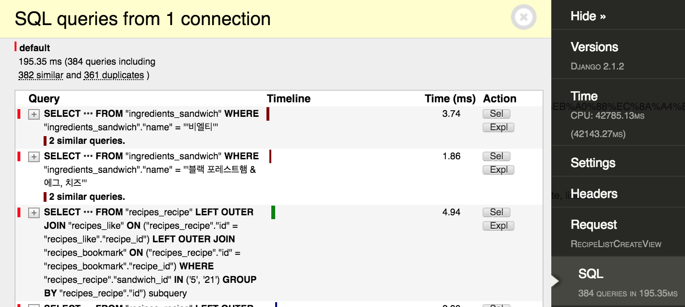
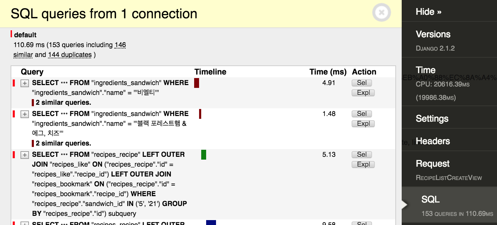
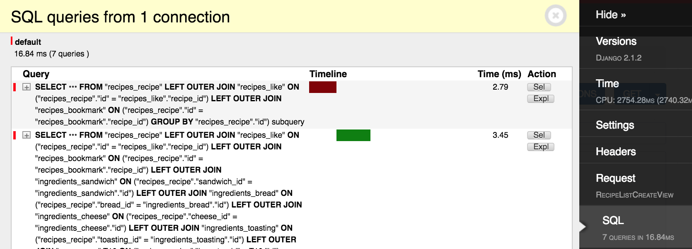
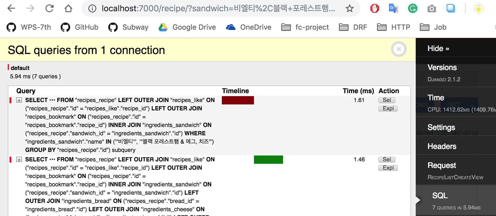

# MySubway v1.0

MySubway is an app where you can keep your own recipes of Subway sandwich.
You can also try various types of sandwiches registered on the app.
You can make good use of it when you actually visit Subway.
Instead of hesitating to choose every ingredient you want, just open Mysubway and read your recipe.\
With MySubway, your Subway life will be much simpler!


<br>

## Used Skills

* Python 3.6.5
* Django 2.1.2
  - django-json-secrets 0.1.10
  - django-debug-toolbar 1.10.1
  - django-storages 1.6.6
* Django REST framework 3.8.2
  - django-filter 2.0.0
* AWS
  - Elastic Beanstalk
  - RDS(Relational Database Service)
  - S3
  - Route53
  - ACM (AWS Certificate Manager)
* Docker, Dockerhub
* OAuth (Web, iOS, Android)
  - Facebook Login
  - Kakao Login
* Database
  - Local(sqlite3)
  - Production & Dev(postgresql)
* Server
  - Nginx
* Git
  - Git Organization
  - Git Fork Repository
* etc
  - Sentry

<br>


## Modeling


<br>


## ERD

<br>


---

# Tips learned from the project
In this review, the example codes have been simplified to make it easier to understand.

### TABLE
[1. Facebook Login Test with access_token](https://github.com/newcompany123/Subway_Server/tree/smallbee#1-facebook-login-test-with-access_token) \
[2. Make Field lookup '__exact__in' available in Django](https://github.com/newcompany123/Subway_Server/tree/smallbee#2-make-field-lookup-__exact__in-available-in-django) \
[3. Display extra string data in json API response using CustomExceptionHandler](https://github.com/newcompany123/Subway_Server/tree/smallbee#3-display-extra-string-data-in-json-api-response-using-customexceptionhandler) \
[4. Find a DjangoFilterBackend bug and fix it with BaseFilterBackend](https://github.com/newcompany123/Subway_Server/tree/smallbee#4-find-a-djangofilterbackend-bug-and-fix-it-with-basefilterbackend) \


<br>

## 1. Facebook Login Test with access_token
This code doesn't follow common OAuth process of Facebook.\
It is because this test is implemented only in back-end area, not in front-end area.
Even if we create similar situation with front-end through Django template, it doesn't guarantee the normal operation in front-end side.\
Instead, we will utilize special test API from Facebook developer.

Shown below is a brief explanation of the review.

    1. First, get app_access_token from Facebook
    2. With the app_access_token, make a test-user
    3. When test user is made successfully, we can get general access-token from that test-user


We are going to use APITestCase from rest_framework.\
First, we need to set some necessary information in the local scope of FacebookLoginTest class.
Get-access_token API(URL_ACCESS_TOKEN) and Facebook Login API (URL_FACEBOOK_LOGIN) are basic information we need.

```python
class FacebookLoginTest(APITestCase):

    # URL_HOST for local / staging test
    SETTINGS_MODULE = os.environ.get('DJANGO_SETTINGS_MODULE')
    if SETTINGS_MODULE == 'config.settings.prod':
        from config.settings import prod
        URL_HOST = prod.URL_HOST
    else:
        from config.settings import local
        URL_HOST = local.URL_HOST

    URL_FACEBOOK_LOGIN = URL_HOST + reverse('user:facebook-login')
    URL_ACCESS_TOKEN = 'https://graph.facebook.com/v2.12/oauth/access_token'
```

URL_HOST is also needed for the specific case.
In this code, we assume that 'app.config.settings' is divided into three parts: local, dev and prod(production).\
To make this test code available both in local and prod environments, URL_HOST needs to be set for each environment as above.


Now let's look at 'test_facebook_login' which is the main method of the whole test code.


```python
    def test_facebook_login(self):

        app_access_token = self.get_app_access_token_from_facebook()
        access_token = self.get_short_term_access_token_from_facebook(app_access_token)

        # Try Facebook Login API
        post_data = {
            'access_token': access_token
        }
        response = requests.post(self.URL_FACEBOOK_LOGIN, post_data)
```

It calls get_app_access_token_from_facebook.


```python
    def get_app_access_token_from_facebook(self):

        # Facebook client_credentials access
        params = {'client_id': settings.FACEBOOK_APP_ID,
                  'client_secret': settings.FACEBOOK_SECRET_CODE,
                  'grant_type': 'client_credentials'}
        response = requests.get(self.URL_ACCESS_TOKEN, params=params)
        response_dict = response.json()
        access_token = response_dict['access_token']
        return access_token
```

In the get_app_access_token_from_facebook method, it sends GET request with parameters including 'grant_type'.\
With the received response data, call _get_json method. _get_json method was made for json exception handling.

```python
    def _get_json(self, response):
        try:
            response_dict = response.json()
        except ValueError:
            raise CustomAPIException("Unexpected response. No JSON object could be decoded.")
        if 'error' in response_dict:
            raise CustomAPIException("Error in response: %r" % response_dict['error'])
        return response_dict
```

The response dict looks like this.

```json
{
    "access_token": "...",
    "token_type": "bearer"
}
```

With this access_token, call get_short_term_access_token_from_facebook method.

```python
    def get_short_term_access_token_from_facebook(self, app_access_token):

        # Facebook app access token access
        url = f'https://graph.facebook.com/v2.12/{settings.FACEBOOK_APP_ID}/accounts/test-users'
        params = {'access_token': app_access_token}
        response = requests.get(url, params=params)

        response_dict = response.json()
        response_data = response_dict.get('data')[0]
        if response_data.get('id'):
            access_token = response_data.get('access_token')
            if not access_token:
                raise CustomAPIException("User %s located, but does not have access_token." % self.id)
            return access_token
        raise CustomAPIException("Unable to find user from response.")
```

The method sends GET request with access_token parameters.\
Response data looks like this.

```json
{
    "data": [{
        "id": "...",
        "login_url": "https://developers.facebook.com/checkpoint/test-user-login/285792995586905/",
        "access_token": "EAATCQq7ICIsBALhe3sbP..."
        }],
    "paging": {
        "cursors": "..."
     }
}
```

Now we have normal access_token which we can test our own Facebook Login API with.\
Now all we have to do is testing Facebook Login API with access_token we just got. And check the response data whether API works correctly.

```python
    def test_facebook_login(self):

        ...

        # Facebook Login API Test
        post_data = {
            'access_token': access_token
        }
        response = requests.post(self.URL_FACEBOOK_LOGIN, post_data)
        response_data = self._get_json(response)

        self.assertEqual(response.status_code, status.HTTP_201_CREATED)
        self.assertEqual(response_data['username'], 'Open')
        self.assertEqual(response_data['email'], '')

        # Delete User from the service
        headers = {
            'Authorization': 'Token ' + response_data['token']
        }
        URL_DELETE_ACCOUNT = self.URL_HOST + reverse('user:user-detail', kwargs={'pk': response_data['id']})
        response = requests.delete(URL_DELETE_ACCOUNT, headers=headers)
        self.assertEqual(response.status_code, status.HTTP_204_NO_CONTENT)
```

<br>


## 2. Make Field lookup '__exact__in' available in Django

### 1) The meaning of Field lookup '__exact__in' and why is is needed


```python
class Recipe(models.Model):

    ...
    sandwich = models.ForeignKey(
        Sandwich,
        on_delete=models.SET_NULL,
        ...
    )
    bread = models.ForeignKey(
        Bread,
        on_delete=models.SET_NULL,
        ...
    )
    cheese = models.ForeignKey(
        Cheese,
        on_delete=models.SET_NULL,
        ...
    )
    toasting = models.ForeignKey(
        Toasting,
        on_delete=models.SET_NULL,
        ...
    )
    toppings = models.ManyToManyField(
        Toppings,
        ...
    )
    vegetables = models.ManyToManyField(
        Vegetables,
        ...
    )
    sauces = models.ManyToManyField(
        Sauces,
        ...
    )


class Sandwich(models.Model):
    ...

class Bread(models.Model):
    ...

class Cheese(models.Model):
    ...

class Toasting(models.Model):
    ...

class Toppings(models.Model):
    ...

class Vegetables(models.Model):
    ...

class Sauces(models.Model):
    ...

```


In the MySubway app, each recipe object should be unique. In other words, there are not the same recipes.\
If the Recipe model has only Foreignkey relations, the solution would be a lot simpler.\
Just add below code into Recipe model. And that's it.

```python
    class Meta:
        unique_together = (
            ('sandwich', 'bread', 'cheese', 'toasting', 'toppings', 'vegetables', 'sauces'),
        )
```

However, unfortunately, unique_together cannot be used with a ManyToMany relationship.\
So, the only way is to make Unique Validator and call it in serializer to check the request data for Recipe Create API.

```python
def validate(self, attrs):

    result = recipe_uniqueness_validator(attrs)

    if not result is True:
        raise CustomAPIException(
            ...
        )
    return attrs


def recipe_uniqueness_validator(attrs, **kwargs):

    # Check whether objects that have same Sandwich exist
    recipe_filtered_list = Recipe.objects \
        .filter(sandwich=attrs.get('sandwich'))

    # Check whether objects that have same Bread exist
    recipe_filtered_list = recipe_filtered_list \
        .filter(sandwich=attrs.get('bread'))

    # Check whether objects that have same Cheese exist
    recipe_filtered_list = recipe_filtered_list \
        .filter(sandwich=attrs.get('cheese'))

    # Check whether objects that have same Toppings exist
        ...

    ...
```

For the foreign key relationship, comparing the request data and ForeignKey field is everything we have to do.\

`recipe_filtered_list = Recipe.objects.filter(sandwich=attrs.get('sandwich'))`

But with ManyToManyFields, it needs Field lookup something like '__exact__in'.\
If we use Field lookup '__in', returned data won't be what we want. For example, Toppings' pk in request data is [1, 3, 5].

`Recipe.objects.filtering(toppings__pk__in=[1, 3, 5]).distinct()`

Filtering above will find not only toppings of [1, 3, 5], but also [1], [1, 3], [1, 3, 5, 6] ...\
So we need to make custom ORM for this specific case.


### 2) Make Field lookup '__exact__in'

First, add an annotation with Count() for numbering of each 'toppings'.
Here, 'toppings' doesn't mean related_query_name, but the one used in the previous filter.
Filtering 'num_toppings=3' to the annotated queryset will return the data.

```python
Recipe.objects\
        .filter(toppings__pk__in=[1, 3, 5]).distinct() \
        .annotate(num_toppings=Count('toppings', distinct=True)) \
        .filter(num_toppings=3)
```

The returned data is very close to the answer but not exactly the one.
It is something that looks like [1, 3, 5], [1, 3, 5, 6], [1, 2, 3, 5].
The data contains every toppings we want to find but there are some extra toppings.\
So, the next step is counting out unnecessary data from the result queryset above.


`
Recipe.objects
        .annotate(num_toppings=Count('toppings'))
        .filter(num_toppings__gt=3)
`

This code will return the queryset that has more than 3 elements like [1, 3, 5, 6], [1, 2, 3, 5].\
Excluding these queryset from the previous queryset will return the exact data we want.\
So, the final solution for Field lookup '__exact__in' is this.

```python
Recipe.objects\
        .filter(toppings__pk__in=[1, 3, 5]).distinct() \
        .annotate(num_toppings=Count('toppings', distinct=True)) \
        .filter(num_toppings=3)
        .exclude(pk__in=Recipe.objects
                .annotate(num_toppings=Count('toppings'))
                .filter(num_toppings__gt=3)
        )
```

In fact, there is another way to do this.
This time, use exclude method twice to get the result.

```python
Recipe.objects\
        .filter(toppings__pk__in=[1, 3, 5]).distinct() \
        .annotate(num_toppings=Count('toppings', distinct=True)) \
        .filter(num_toppings=3)
        .exclude(sauces__in=Sauces.objects.exclude(pk__in=[1, 3, 5])
```

`Sauces.objects.exclude(pk__in=[1, 3, 5]`
The code means data like [1], [1, 3], [1, 5], [3, 5] ...\
So the queryset of excluding this data doesn't contain three elements we want to find: 1, 3, 5.\
Excluding these queryset again from the previous queryset will also return the answer we want.


Here is simple format for '__exact__in' in Django

```python
.filter(<field>__in=[...])
.annotate(num_<field>=Count('<field>', distinct=True)
.filter(num_<field>=len([...]))
.exclude(<field>__in=
        <Model_name_of_field>.objects.exclude(pk__in=[])
```

<br>


## 3. Display extra string data in json API response using CustomExceptionHandler


Second code review above covered the uniqueness of the Recipe model.
And when the Recipe Unique Validator finds the same recipe already existing in the DATABASE, it will return the response as below.

```json
{
    "detail": "Same sandwich recipe already exists!",
}
```

But, front-end developers need more than the error message.
They also need the exact number of the duplicate recipe to let user visit the page of the duplicate recipe.
To do that, we need to turn response into something like this.

```json
{
    "detail": "Same sandwich recipe already exists!",
    "pk": 11
}
```

Let's make this response using CustomExceptionHandler. \
First, look at the CustomAPIException to add the extra pk information.

```python
from rest_framework import status
from rest_framework.exceptions import APIException

class CustomAPIException(APIException):

    status_code = status.HTTP_400_BAD_REQUEST
    detail = 'Invalid input.'
    default_code = 'invalid'

    def __init__(self, status_code=None, detail=None):

        if status_code is not None:
            self.status_code = status_code
        if detail is not None:
            self.detail = detail
```

This Custom Exception works when it is called with 'raise CustomAPIException(...)' statement.


```python
from rest_framework import status

    ...
    raise CustomAPIException(
                status_code=status.HTTP_400_BAD_REQUEST,
                detail='Same sandwich recipe already exists!',
            )
```

With this Custom Exception, we cannot just add extra data to the response message.\
In this situation, we can consider Custom Exception Handler.


```python
from rest_framework.views import exception_handler


def custom_exception_handler(exc, context):

    response = exception_handler(exc, context)

    # put 'pk' data to response here

    return response
```

Every exception raised in the app goes through Custom Exception Handler.
Therefore, we need to add the data to the response when the exception from Recipe Unique Validator comes to Custom Exception Handler.

To do this, we need to pass 'pk' information to Custom Exception as below.


```python
from rest_framework import status

    ...
    raise CustomAPIException(
                status_code=status.HTTP_400_BAD_REQUEST,
                detail='Same sandwich recipe already exists!',
                pk=result,
            )
```

Then, Custom Exception get this 'pk' data through keyword argument.


```python
from rest_framework import status
from rest_framework.exceptions import APIException

class CustomAPIException(APIException):

    status_code = status.HTTP_400_BAD_REQUEST
    detail = 'Invalid input.'
    default_code = 'invalid'

    def __init__(self, status_code=None, detail=None, pk=None):

        if status_code is not None:
            self.status_code = status_code
        if detail is not None:
            self.detail = detail

        if pk:
            self.pk = pk

```

Assigning received 'pk' data into self.pk in __init__ method will pass the data to Custom Exception Handler.
Then, it can be obtained with 'exc' argument in Custom Exception Handler.


```python
def custom_exception_handler(exc, context):

    response = exception_handler(exc, context)

    try:
        if exc.pk:
            response.data['pk'] = exc.pk
    finally:
        return response

```

Finally, put 'pk' data into response dict.
'try ~ finally' statement is for raising an error when there is no 'pk' data, which is for the case of all other exceptions.

Now, we can get the response with 'pk' data.

```json
{
    "detail": "Same sandwich recipe already exists!",
    "pk": 11
}
```

<br>

If you understand the explanation till this point, let's go further step with this code.

Although we can display pk data in the API response when user try making an existing recipe, there could be many similar situations. \
In other words, we might want to display other data such as "duplicate_name": "my best sandwich!". \
We are going to take advantage of Python function's trait: Python function can accept unlimited number of keyword arguments using '**kwargs'.


Let's pass "duplicate_name=name" instead of "pk=result"


```python
from rest_framework import status

    ...
    raise CustomAPIException(
                status_code=status.HTTP_400_BAD_REQUEST,
                detail='collection name already exist',
                duplicate_name=name,
            )
```

And, we need to accept the data in CustomAPIException. \
look at the difference in parameters of __init__ method.

```python
class CustomAPIException(APIException):

    status_code = status.HTTP_400_BAD_REQUEST
    detail = 'Invalid input.'
    default_code = 'invalid'

    def __init__(self, status_code=None, detail=None, **kwargs):
        ...
```

keyword arguments received from **kwargs are dictionary data, which means we can display input 'key' in the API response too.

To extract the key from the dictionary, use dictionary's 'keys' function.

e.g.
```
$ kwargs
>> { 'key1': 'a', 'key2': 'b', ...}
$ kwargs.keys()
>> dict_keys(['key1', 'key2'])
$ list(kwargs.keys())
>> ['key1', 'key2']
$ list(kwargs.keys())[0]
'key1'
```

Using 'keys' function, we can assign 'key' and 'value'.

```python
class CustomAPIException(APIException):

    status_code = status.HTTP_400_BAD_REQUEST
    detail = 'Invalid input.'
    default_code = 'invalid'

    def __init__(self, status_code=None, detail=None, **kwargs):

        if status_code is not None:
            self.status_code = status_code
        if detail is not None:
            self.detail = detail

        if kwargs:
            self.key = list(kwargs.keys())[0]
            self.value = kwargs[self.key]
```


The only thing left is modifying custom_exception_handler function.


```python
def custom_exception_handler(exc, context):

    response = exception_handler(exc, context)

    try:
        # if exc.pk:
        #     response.data['pk'] = exc.pk
        if exc.key and exc.value:
            response.data[exc.key] = exc.value
    finally:
        return response
```


Now, we can display any string data in the API response.


```json
{
    "detail": "collection name already exist",
    "duplicate_name": "..."
}
```

<br>


## 4. Find a DjangoFilterBackend bug and fix it with BaseFilterBackend

The first page of MySubway app shows the rank of Sandwich Recipe. \
As the page should shows the latest data, it brings all objects from the database and turn into python objects.
This can make a problem with big Sandwich recipes data. \
For this reason, checked the efficiency of the rank page with django-debug-toolbar. \
The result was pretty serious.



Loading just 18 objects makes 384 queries(including 382 similar and 361 duplicates) in Django.
It seems that the server will be down even with a small amount of data.
To solve the problem, used one of the most effective ways, using select_related, prefetch_related.


```python
    def get_queryset(self):

        value = Recipe.objects \
            .select_related('sandwich', 'bread', 'cheese', 'toasting', 'inventor') \
            .prefetch_related('toppings', 'vegetables', 'sauces',
                              'sandwich__main_ingredient', 'sandwich__category')
        return value
```

Use select_related with OneToOneField and ForeignKey of Recipe, and prefetch_related with ManyToManyField. \
As you can see, add 'sandwich__main_ingredient' and 'sandwich__category' too because those models are also displayed in the Recipe API Response. \
(Just think add every field that is displayed in the json API response) \
Let's check the django-debug-toolbar again.



The duplicated queries decreased from 384 to 153. But it still makes 144 duplicate queries. \
After a long time of debugging, it turned out that the DjangoFilterBackend caused the problem. \
Without DjangoFilterBackend, the django made only 7 queries.




The DjangoFilterBackend code used in the project was the way written in official Django REST framework website.


`Django REST framework official guide` \
[https://www.django-rest-framework.org/api-guide/filtering/#api-guide](https://www.django-rest-framework.org/api-guide/filtering/#api-guide)


<br>

`My Code - Using default DjangoFilterBackend`

```python
class RecipeListCreateView(generics.ListCreateAPIView):

    ...

    filter_backends = (DjangoFilterBackend, ...)
    filter_fields = ('sandwich',)

```

And even with FilterSet class(Custom usage of DjangoFilterBackend), django made 144 duplicate queries.


`My Code (2) - Using FilterSet`

```python
class ListFilter(Filter):
    def filter(self, qs, value):
        if not value:
            return qs

        self.lookup_expr = 'in'
        value = value.replace(', ', '_ ')
        values_text = value.split(',')
        values = []
        for value in values_text:
            value = value.replace('_ ', ', ')
            obj = Sandwich.objects.get(name=value)
            values.append(obj.id)
        return super().filter(qs, values)


class RecipeFilter(FilterSet):
    sandwich = ListFilter()

    class Meta:
        model = Recipe
        fields = (
            'sandwich',
        )

class RecipeListCreateView(generics.ListCreateAPIView):

    ...

    filter_backends = (DjangoFilterBackend, ...)
    filter_class = RecipeFilter

```


Later on, I found the person who experienced the same issue in django-rest-framework github page.

Link : [Duplicate results of ManyToManyField when using SearchFilter.](https://github.com/encode/django-rest-framework/issues/1488)

In the post of the issue, the user named 'mmedal' said that he made a solution and made a pull request. \
So, I checked the code of [django-rest-framework/rest-framework/filters.py](https://github.com/tomchristie/django-rest-framework/blob/master/rest_framework/filters.py#L107) and it was fixed as he said in the issue post.


```python
class SearchFilter(BaseFilterBackend):

    ...

    def filter_queryset(self, request, queryset, view):

        ...

        if self.must_call_distinct(queryset, search_fields):
            # Filtering against a many-to-many field requires us to
            # call queryset.distinct() in order to avoid duplicate items
            # in the resulting queryset.
            # We try to avoid this if possible, for performance reasons.
            queryset = distinct(queryset, base)
        return queryset
```

This code implement inheritance with 'BaseFilterBackend'. BaseFilterBackend was the basic way written in official Django REST framework website.

`Django REST framework official guide (2)` \
[https://www.django-rest-framework.org/api-guide/filtering/#custom-generic-filtering](https://www.django-rest-framework.org/api-guide/filtering/#custom-generic-filtering)


I tried again using BaseFilterBackend with filter_queryset method. \
Using filter_queryset method of BaseFilterBackend needs a little more works than using DjangoFilterBackend or FilterSet. \
Query parameter should be extracted from request and also queryset should be made and returned.


```python
class RecipeFilter(BaseFilterBackend):
    """
    Filter Recipe with category
    """
    def filter_queryset(self, request, queryset, view):
        params = request.query_params.get('sandwich')

        if params:
            params = params.replace(', ', '_ ')
            params_text = params.split(',')
            sandwich_list = [x.replace('_ ', ', ') for x in params_text]
            queryset = queryset.filter(sandwich__name__in=sandwich_list)
        return queryset


class RecipeListCreateView(generics.ListCreateAPIView):

    ...

    filter_backends = (RecipeFilter, ...)

```

After all, we succeed optimizing queries with no duplicate.





In conclusion, the way of using DjangoFilterBackend or FilterSet as guide of Django REST framework still cause a duplicate queries issue. \
For now, use BaseFilterBackend with filter_queryset method since it fixed the bug. \


<br>
